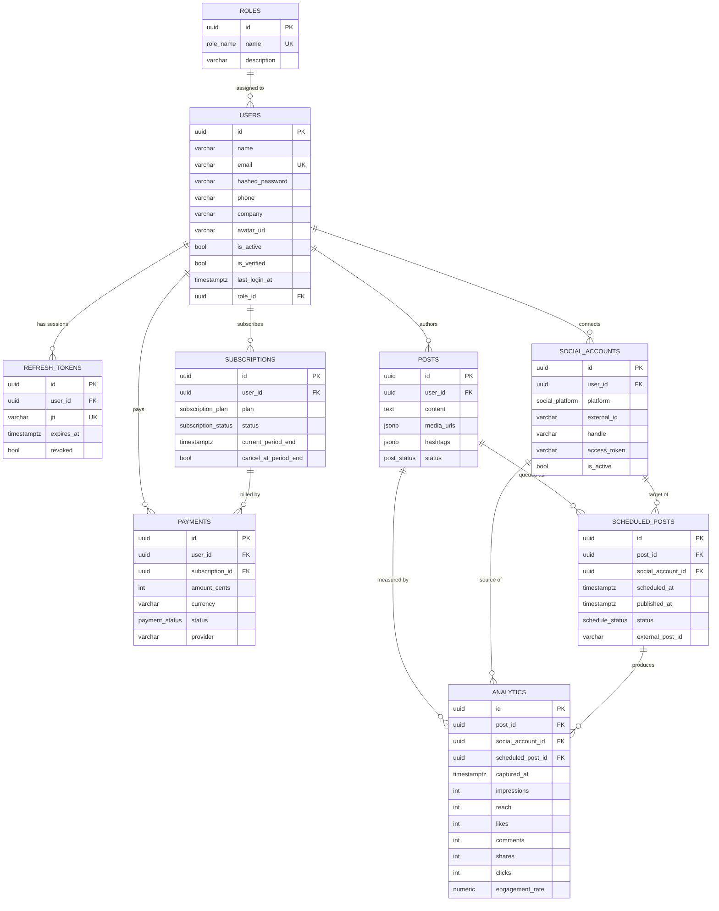

# Postly — Database Design

PostgreSQL schema for the Postly social-media management platform. Canonical DDL
lives in [`schema.sql`](./schema.sql); the SQLAlchemy models in
`backend/app/models` are the source of truth for the application.

## ER Diagram

## Relationships

| Parent | Child | Cardinality | On delete |
|---|---|---|---|
| roles | users | 1 → N | RESTRICT (can't delete a role in use) |
| users | refresh_tokens | 1 → N | CASCADE |
| users | social_accounts | 1 → N | CASCADE |
| users | posts | 1 → N | CASCADE |
| users | subscriptions | 1 → N | CASCADE |
| users | payments | 1 → N | CASCADE |
| subscriptions | payments | 1 → N | SET NULL |
| posts | scheduled_posts | 1 → N | CASCADE |
| social_accounts | scheduled_posts | 1 → N | CASCADE |
| posts | analytics | 1 → N | CASCADE |
| social_accounts | analytics | 1 → N | CASCADE |
| scheduled_posts | analytics | 1 → N | SET NULL |

## Indexing strategy

- **Primary keys** are UUID v4 (`gen_random_uuid()`) — avoids sequential-ID
  enumeration and makes IDs safe to expose in the API.
- **Lookups:** unique index on `users.email`, unique `refresh_tokens.jti`
  (validated on every token refresh), unique
  `social_accounts (user_id, platform, external_id)`.
- **Foreign keys** are all indexed (Postgres does *not* auto-index FK columns) to
  keep joins and cascade deletes fast.
- **Hot query paths:**
  - `ix_scheduled_posts_due (status, scheduled_at)` — the publishing worker polls
    `WHERE status='queued' AND scheduled_at <= now()`; this composite index makes
    that a range scan.
  - `ix_posts_status`, `ix_subscriptions_status`, `ix_payments_status` — status
    filters used by list endpoints and billing jobs.
  - `ix_analytics_captured_at` — time-range analytics rollups.

## Optimization & scaling notes

- **Connection pooling** via SQLAlchemy async engine (`pool_size=10`,
  `max_overflow=20`, `pool_pre_ping=True`). Put PgBouncer in front for high
  concurrency.
- **JSONB** for `media_urls` / `hashtags` avoids extra join tables for small,
  read-mostly arrays; add a GIN index if you later query inside them.
- **Analytics growth:** the `analytics` table is append-only and grows fastest.
  Partition by `captured_at` (monthly range partitions) and roll up into a
  materialized view for dashboards once volume warrants it.
- **Token hygiene:** a scheduled job should delete `refresh_tokens` where
  `expires_at < now()` or `revoked = true` to keep the table small.
- **Encrypt** `social_accounts.access_token / refresh_token` at rest
  (pgcrypto or application-level KMS) — they are OAuth credentials.
- **Read replicas:** analytics/reporting reads can target a replica; writes
  (publishing, auth) stay on the primary.
